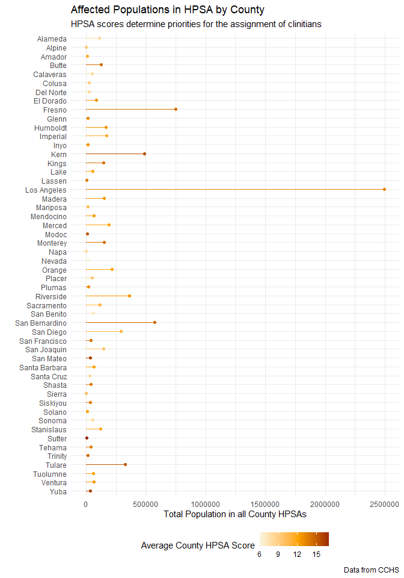

{rcahelpr}
================

## ❓ What and Why is This?

In short, a tool to support the Resident Corrections Analyst program
through bespoke functions written in R and data sets for learning
purposes. Interested? You can install is using R:

``` r
remotes::install_github("cllghn/rcahelpr")
```

## 🔎 Examples

### 📚 Codebooks

Codebooks are often to provide a comprehensive guide to the variables
and coding schemes in a data set, ensuring consistent and accurate
interpretation of data. They serve as a reference tool to facilitate
understanding and analysis of complex data structures by researchers and
analysts. To support this crucial functionality, we include a codebook
function into this package:

``` r
# Load the library
library(rcahelpr)

# Create a test data set
test <- data.frame(
  "person" = c("chris", "maeve", "joseph", "brooks"),
  "org" = c("csg", "wdoc", "ccjbh", "asu"),
  "years_in_org" = c(1, 0.3, 0.2, NA),
  "role" = c("mentor", "rca", "rca", "mentor")
)

# Create codebook
make_codebook(input_df = test, return_df = FALSE, escape = FALSE)
```

<table class="table" style="margin-left: auto; margin-right: auto;">
<thead>
<tr>
<th style="text-align:left;">
Variable Name
</th>
<th style="text-align:left;">
Data Class
</th>
<th style="text-align:left;">
Valid Values
</th>
<th style="text-align:left;">
Statistics
</th>
<th style="text-align:right;">
Unique Values
</th>
<th style="text-align:left;">
Missing Values
</th>
</tr>
</thead>
<tbody>
<tr>
<td style="text-align:left;">
person
</td>
<td style="text-align:left;">
Character
</td>
<td style="text-align:left;">
Unique strings (n=4): chris, maeve, joseph, and more.
</td>
<td style="text-align:left;">
4 unique strings, top three: <br> brooks (n=1) <br> chris (n=1) <br>
joseph (n=1)
</td>
<td style="text-align:right;">
4
</td>
<td style="text-align:left;">
0 (0%)
</td>
</tr>
<tr>
<td style="text-align:left;">
org
</td>
<td style="text-align:left;">
Character
</td>
<td style="text-align:left;">
Unique strings (n=4): csg, wdoc, ccjbh, and more.
</td>
<td style="text-align:left;">
4 unique strings, top three: <br> asu (n=1) <br> ccjbh (n=1) <br> csg
(n=1)
</td>
<td style="text-align:right;">
4
</td>
<td style="text-align:left;">
0 (0%)
</td>
</tr>
<tr>
<td style="text-align:left;">
years_in_org
</td>
<td style="text-align:left;">
Numeric
</td>
<td style="text-align:left;">
Numeric range from 0.2 to 1.
</td>
<td style="text-align:left;">
Min: 0.2 <br> Avg: 0.5 <br> Median: 0.3 <br> Max: 1 <br> SD: 0.44
</td>
<td style="text-align:right;">
4
</td>
<td style="text-align:left;">
1 (25%)
</td>
</tr>
<tr>
<td style="text-align:left;">
role
</td>
<td style="text-align:left;">
Character
</td>
<td style="text-align:left;">
Unique strings: mentor, rca.
</td>
<td style="text-align:left;">
2 Unique strings: <br> mentor (n=2) <br> rca (n=2) <br> NA (n=NA)
</td>
<td style="text-align:right;">
2
</td>
<td style="text-align:left;">
0 (0%)
</td>
</tr>
</tbody>
</table>

Should you want to add information to describe the variables described
in the codebook, you can do so by left joining and additional data set:

``` r
# Set a secondary data.frame describing the variables in your original data set
more <- data.frame(
  "vars" = c("person", "org", "years_in_org", "role"),
  "description" = rep("Interesting details about my variable.", 4),
  "origin" = rep("Detailed notes on where the data came from.", 4),
  "notes" = rep("Yet more useful information", 4)
)

# Create codebook
make_codebook(input_df = test, return_df = FALSE, escape = FALSE,
              extra_vars = more, extra_key = "vars")
```

<table class="table" style="margin-left: auto; margin-right: auto;">
<thead>
<tr>
<th style="text-align:left;">
Variable Name
</th>
<th style="text-align:left;">
Data Class
</th>
<th style="text-align:left;">
Valid Values
</th>
<th style="text-align:left;">
Statistics
</th>
<th style="text-align:right;">
Unique Values
</th>
<th style="text-align:left;">
Missing Values
</th>
<th style="text-align:left;">
Description
</th>
<th style="text-align:left;">
Origin
</th>
<th style="text-align:left;">
Notes
</th>
</tr>
</thead>
<tbody>
<tr>
<td style="text-align:left;">
org
</td>
<td style="text-align:left;">
Character
</td>
<td style="text-align:left;">
Unique strings (n=4): csg, wdoc, ccjbh, and more.
</td>
<td style="text-align:left;">
4 unique strings, top three: <br> asu (n=1) <br> ccjbh (n=1) <br> csg
(n=1)
</td>
<td style="text-align:right;">
4
</td>
<td style="text-align:left;">
0 (0%)
</td>
<td style="text-align:left;">
Interesting details about my variable.
</td>
<td style="text-align:left;">
Detailed notes on where the data came from.
</td>
<td style="text-align:left;">
Yet more useful information
</td>
</tr>
<tr>
<td style="text-align:left;">
person
</td>
<td style="text-align:left;">
Character
</td>
<td style="text-align:left;">
Unique strings (n=4): chris, maeve, joseph, and more.
</td>
<td style="text-align:left;">
4 unique strings, top three: <br> brooks (n=1) <br> chris (n=1) <br>
joseph (n=1)
</td>
<td style="text-align:right;">
4
</td>
<td style="text-align:left;">
0 (0%)
</td>
<td style="text-align:left;">
Interesting details about my variable.
</td>
<td style="text-align:left;">
Detailed notes on where the data came from.
</td>
<td style="text-align:left;">
Yet more useful information
</td>
</tr>
<tr>
<td style="text-align:left;">
role
</td>
<td style="text-align:left;">
Character
</td>
<td style="text-align:left;">
Unique strings: mentor, rca.
</td>
<td style="text-align:left;">
2 Unique strings: <br> mentor (n=2) <br> rca (n=2) <br> NA (n=NA)
</td>
<td style="text-align:right;">
2
</td>
<td style="text-align:left;">
0 (0%)
</td>
<td style="text-align:left;">
Interesting details about my variable.
</td>
<td style="text-align:left;">
Detailed notes on where the data came from.
</td>
<td style="text-align:left;">
Yet more useful information
</td>
</tr>
<tr>
<td style="text-align:left;">
years_in_org
</td>
<td style="text-align:left;">
Numeric
</td>
<td style="text-align:left;">
Numeric range from 0.2 to 1.
</td>
<td style="text-align:left;">
Min: 0.2 <br> Avg: 0.5 <br> Median: 0.3 <br> Max: 1 <br> SD: 0.44
</td>
<td style="text-align:right;">
4
</td>
<td style="text-align:left;">
1 (25%)
</td>
<td style="text-align:left;">
Interesting details about my variable.
</td>
<td style="text-align:left;">
Detailed notes on where the data came from.
</td>
<td style="text-align:left;">
Yet more useful information
</td>
</tr>
</tbody>
</table>

### 📊 Data

Some key data sets, for learning or general use have been included in
the library. Access them using the `::` accessor:

``` r
str(rcahelpr::hpsa_primarycare)
```

    ## 'data.frame':    230 obs. of  17 variables:
    ##  $ HPSA_Discipline_Class           : chr  "Primary Care" "Primary Care" "Primary Care" "Primary Care" ...
    ##  $ HPSA_Name                       : chr  "Low Income - MSSA 78.2ddd/Bell SW/Cudahy/Maywood/V" "MSSA 6/Pioneer" "MSSA 78.2uuu/Athens" "MSSA 137/Isleton" ...
    ##  $ HPSA_ID                         : chr  "1061017434" "1061018308" "1061038158" "1061081242" ...
    ##  $ County_Equivalent_Name          : chr  "Los Angeles" "Amador" "Los Angeles" "Sacramento" ...
    ##  $ Designation_Type                : chr  "HPSA Population" "Geographic HPSA" "High Needs Geographic HPSA" "Geographic HPSA" ...
    ##  $ HPSA_Population_Type            : chr  "Low Income Population HPSA" "Geographic Population" "Geographic Population" "Geographic Population" ...
    ##  $ HPSA_Score                      : int  13 16 18 9 12 15 10 9 19 11 ...
    ##  $ PC_MCTA_Score                   : int  NA NA NA NA NA 18 NA 13 NA NA ...
    ##  $ HPSA_Provider_Ratio_Goal        : chr  "3000:1" "3500:1" "3000:1" "3500:1" ...
    ##  $ HPSA_FTE                        : num  0.16 0.1 3.75 0.95 9.26 3.2 1.75 27.5 4 0 ...
    ##  $ HPSA_Designation_Population     : int  53040 5848 84994 5597 39476 17795 13687 101329 54088 7045 ...
    ##  $ HPSA_Formal_Ratio               : chr  "331500:1" "58480:1" "22665:1" "5892:1" ...
    ##  $ HPSA_Shortage                   : num  17.52 1.57 24.58 0.65 3.9 ...
    ##  $ HPSA_Status                     : chr  "Proposed For Withdrawal" "Proposed For Withdrawal" "Proposed For Withdrawal" "Proposed For Withdrawal" ...
    ##  $ HPSA_Designation_Date           : chr  "9/12/2011" "7/11/2008" "10/9/2012" "5/13/2008" ...
    ##  $ HPSA_Designation_Last_Update_Dat: chr  "9/10/2021" "9/10/2021" "5/20/2022" "9/10/2021" ...
    ##  $ Data_Warehouse_Record_Create_Dat: chr  "1/17/2023" "1/17/2023" "1/17/2023" "1/17/2023" ...

This means that we can use these data for a range of purposes, such as
pairing them with other libraries and analyzing it:

``` r
# Load the graphing library ggplot2 and data management library dplyr
library(dplyr)
library(ggplot2)

# Wrangle some data to identify the average Health Professional Shortage Area 
# (HPSA) score in a given county:
demo <- rcahelpr::hpsa_primarycare %>%
  group_by(County_Equivalent_Name) %>%
  summarize(mean_hpsa_score = mean(HPSA_Score),
            total_hpsa_population = sum(HPSA_Designation_Population))

# Make a beautiful graph
ggplot(data = demo) +
  geom_point(aes(x = total_hpsa_population , y = County_Equivalent_Name,
                 color = mean_hpsa_score)) +
  geom_segment(aes(x = 0 , xend = total_hpsa_population ,
                   y = County_Equivalent_Name, yend = County_Equivalent_Name,
                   color = mean_hpsa_score)) +
  theme_minimal() +
  labs(title = "Affected Populations in HPSA by County",
       subtitle = "HPSA scores determine priorities for the assignment of clinitians",
       caption = "Data from CCHS") +
  xlab("Total Population in all County HPSAs") +
  ylab("") +
  scale_color_gradient2(low="#F5F5DC", mid = "#FFA500", high="#8B0000", 
                        midpoint = mean(demo$mean_hpsa_score),
                        name = "Average County HPSA Score")
```

<!-- -->
